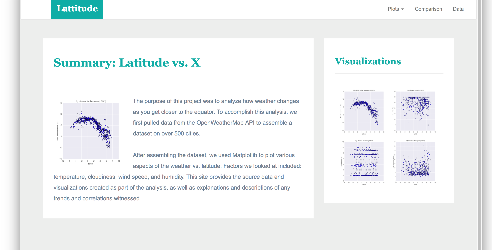
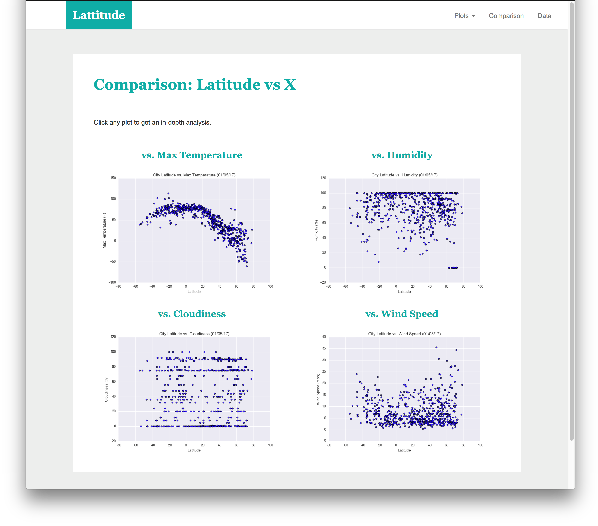
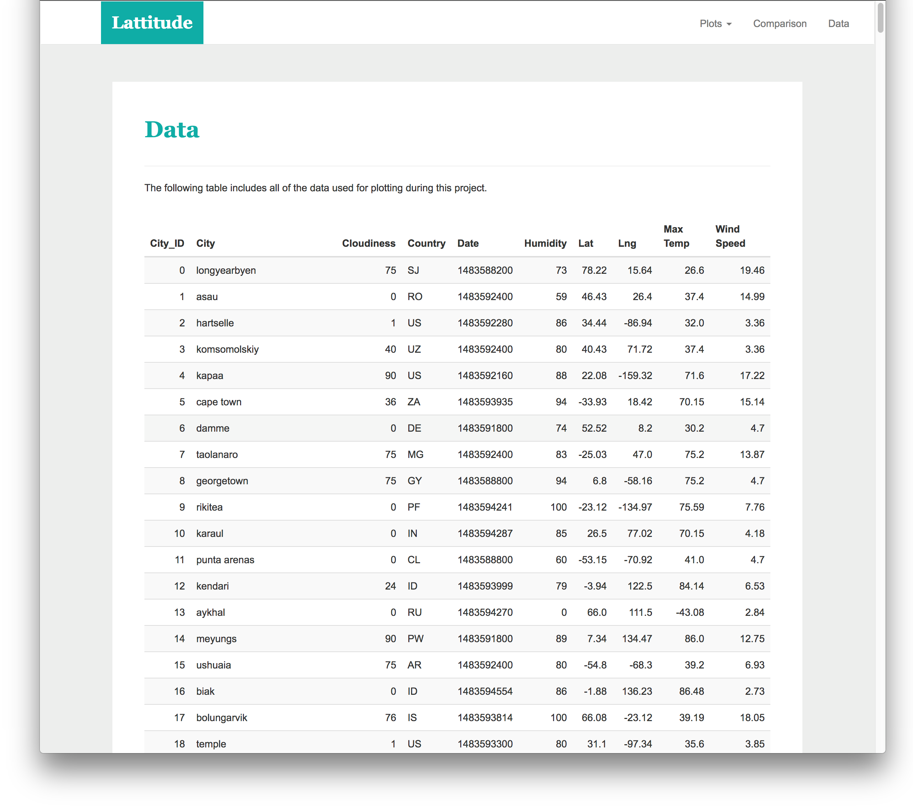
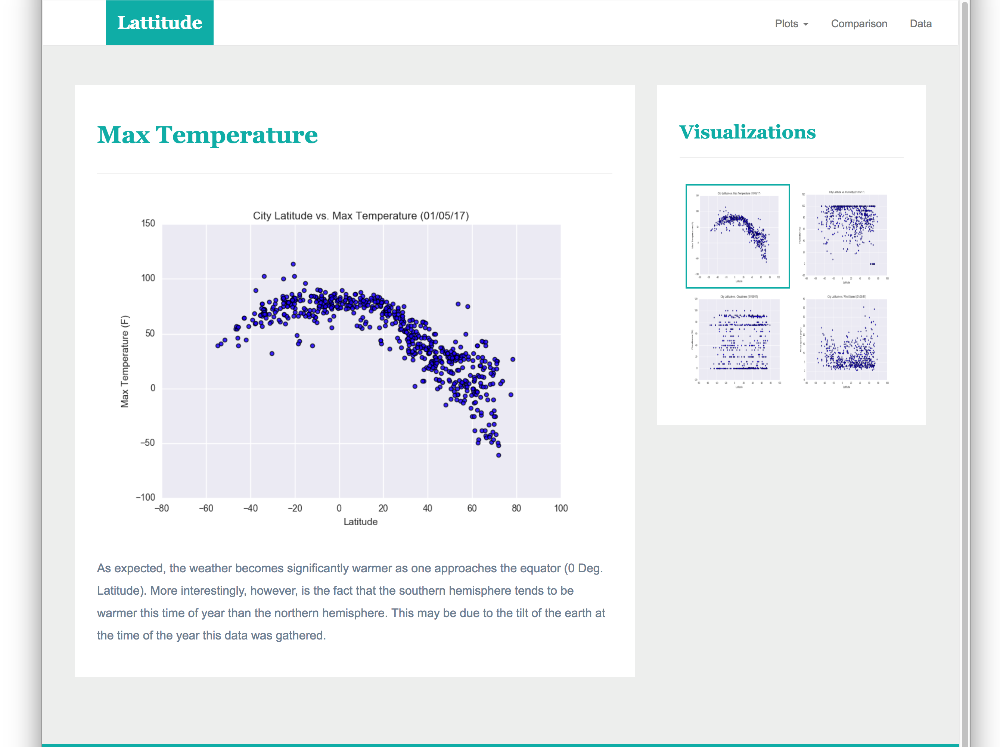

# Web-Design-Challenge
## Summary ##
For this homework, we created a website where visualizations of multiple plots could be accessed and navigated. Explanations are provided to help provide understanding for each visualization. A landing page was created to contain comparisons of plots and other pages where the data related to the plots can be found.
## Tool ##
Python (Jupyter notebook), HTML, CSS
## Visualization ##
The website contains the following:
#### Landing page:

#### Comparisons page:

#### Data page:

#### Four Visualization pages:

